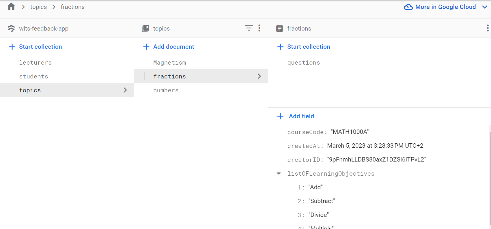
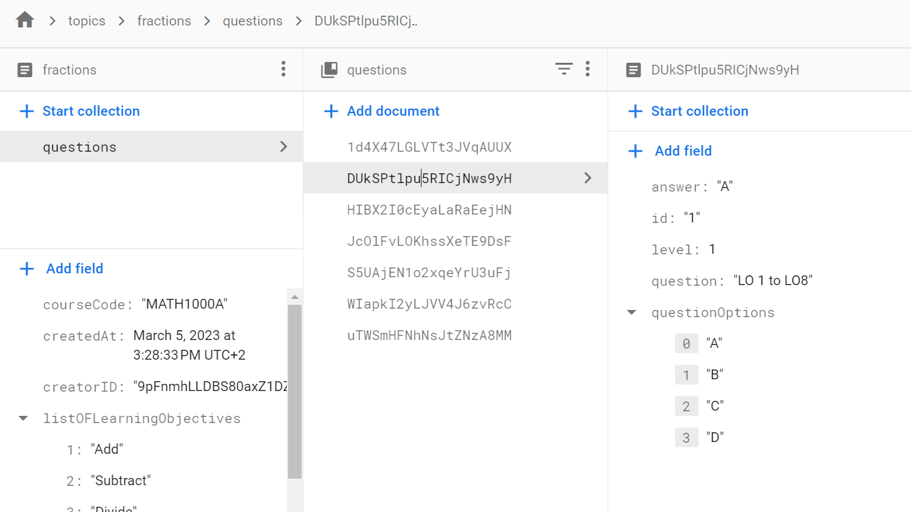
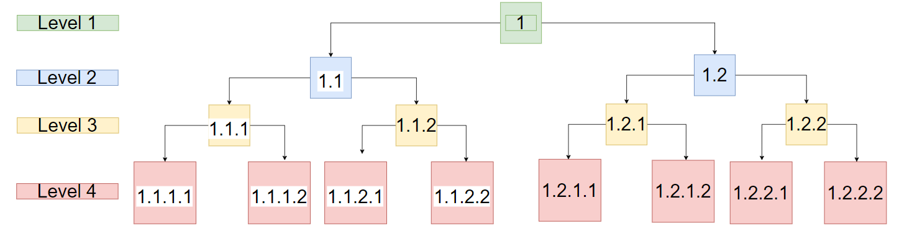
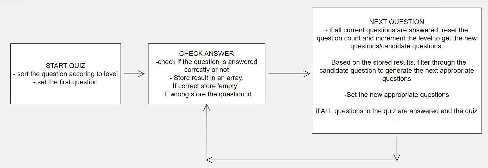

This is a [Next.js](https://nextjs.org/) project bootstrapped with [`create-next-app`](https://github.com/vercel/next.js/tree/canary/packages/create-next-app).

## Getting Started

First, run the development server:

```bash
npm run dev
# or
yarn dev
# or
pnpm dev
```

Open [http://localhost:3000](http://localhost:3000) with your browser to see the result.

You can start editing the page by modifying `pages/index.tsx`. The page auto-updates as you edit the file.

[API routes](https://nextjs.org/docs/api-routes/introduction) can be accessed on [http://localhost:3000/api/hello](http://localhost:3000/api/hello). This endpoint can be edited in `pages/api/hello.ts`.

The `pages/api` directory is mapped to `/api/*`. Files in this directory are treated as [API routes](https://nextjs.org/docs/api-routes/introduction) instead of React pages.

This project uses [`next/font`](https://nextjs.org/docs/basic-features/font-optimization) to automatically optimize and load Inter, a custom Google Font.

## Learn More

To learn more about Next.js, take a look at the following resources:

- [Next.js Documentation](https://nextjs.org/docs) - learn about Next.js features and API.
- [Learn Next.js](https://nextjs.org/learn) - an interactive Next.js tutorial.

You can check out [the Next.js GitHub repository](https://github.com/vercel/next.js/) - your feedback and contributions are welcome!

## Deploy on Vercel

The easiest way to deploy your Next.js app is to use the [Vercel Platform](https://vercel.com/new?utm_medium=default-template&filter=next.js&utm_source=create-next-app&utm_campaign=create-next-app-readme) from the creators of Next.js.

Check out our [Next.js deployment documentation](https://nextjs.org/docs/deployment) for more details.

# Quiz Details

This is an exam prep website. This website helps students figure out which learning objective/s they need to focus on. The quiz consists of 4 levels of questions which will be dispalyed based on the students results of the previous question. This is the latest version out of 2. The previous version will be provided upon request.

## Example
Let's consider a student focusing on a concept which has 8 learning objectives.
The first level consits of one massive question that covers all 8 of the learning objectives LO1 to LO8. The second level consits of two questions that each cover 4 of the learning objectives LO1 to LO4 and LO5 to LO8. The third level consits of four questions that each cover 2 of the learning objectives LO1 to LO2, LO3 to LO4,LO5 to LO6, LO7 to LO8. Finally level four consits of 8 questions each of which are about the individual learning objective LO1, LO2, ..., LO8. In total there are 15 questions.

If the student answers the first question correctly the quiz ends which means the student understands all of the learning objectives.
If the student answers a question incorrectly let's say a question about LO1 to LO4, the student will have to answer two questions in the following level. One about LO1 to LO2 and another about LO3 to LO4.


## Database
The questions are stored in a firestore database as follows 
Each question is structured as follows 
Pay great attention to the id of each question. 

## Logic
 

## Improvements needed
- Instead of manually adding the ids -since they can get complicated- in the companion website (https://exam-prep-lt9sf92rb-thembamtshelwane.vercel.app) the ids should be implicitly linked to the questions instead of explicitly.
- The student's results should be stored in the database.

For the extra features
- In the dashboard, there should be a list of available quizes instead of a hard coded fractions quiz. 
- Upon selecting the specific quiz from the list, route to that quiz and its data.

## Website
https://exam-prep-students.vercel.app/
